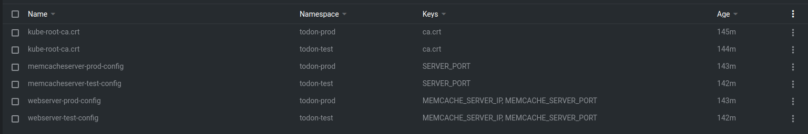
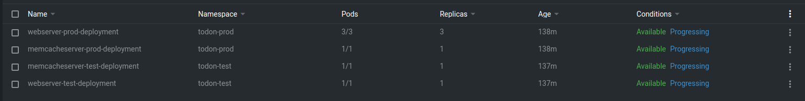
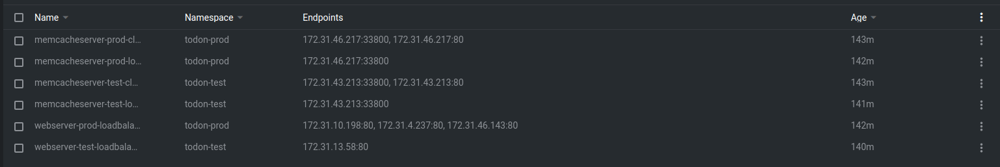
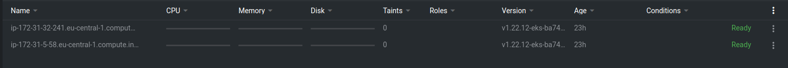
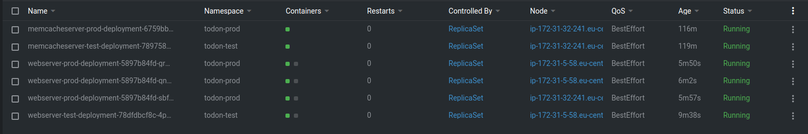
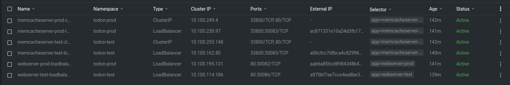
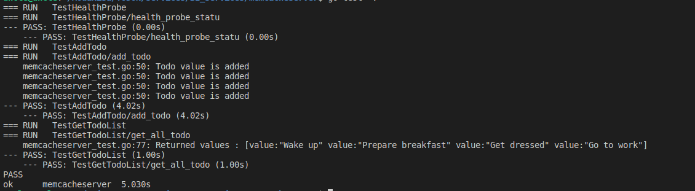
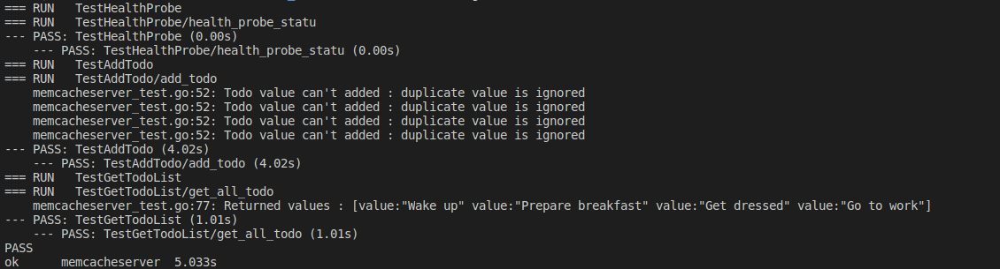
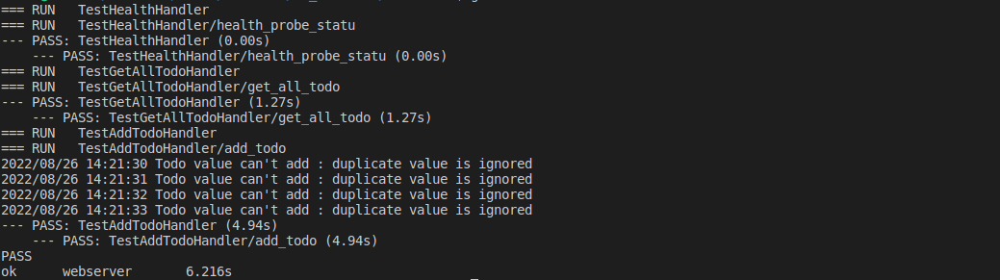

# Aws - Eks

## ConfigMaps

## Deployments

## EndPoints

## Nodes

## Pods

## Services

# CI/CD Pipeline

## Pipeline

## Pipeline Done

# Unit Tests

## Mem-Cache Server Test

## Mem-Cache Server Test Duplicate Data

## Web Server Test

