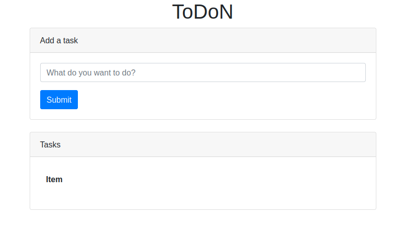
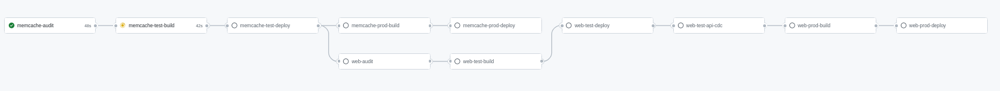
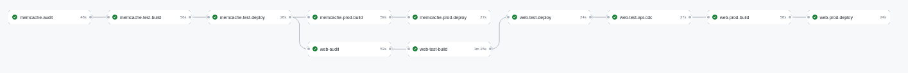

[](https://choosealicense.com/licenses/mit/)

# ToDoN

Bu uygulama web tabanlı bir Todo List uygulamasıdır.

##




## Demo

Demo uygulama buradan erişebilirsiniz :

- [@live-demo](http://aab6a856cd8984348b4e34a58610665f-1150680336.eu-central-1.elb.amazonaws.com)


## Environment Variables

### Actions

To run this project, you will need to add the following environment variables to your 

Gtihub.com -> Repo -> Settings -> Secrets->Actions

`AWS_ACCESS_KEY_ID`

`AWS_REGION`

`AWS_SECRET_ACCESS_KEY`

`DOCKER_HUB_ACCESS_TOKEN` -> Docker.com -> Security > New Access Token

`DOCKER_HUB_USERNAME`

`KUBE_CONFIG_DATA` -> cat $HOME/.kube/config | base64

### Web Server - Test

To test this project, you will need to add the following environment variables

`MEMCACHE_SERVER_IP`

`MEMCACHE_SERVER_PORT` 

## Run Locally

Clone the project

```bash
  git clone https://link-to-project
```

Go to the project directory

```bash
  cd my-project
```

Install dependencies

```bash
  npm install
```

Start the server

```bash
  npm run start
```

## API Reference

#### Get all Todos

```http
  GET /api/v1/all
```

| Parameter | Type     | Description                |
| :-------- | :------- | :------------------------- |
| ` N/A   ` | `      ` |                            |

#### Add a new todo

```http
  POST /api/v1/add/
```

| Data      | Type     | Description                       |
| :-------- | :------- | :-------------------------------- |
| `Item`    | `string` | **Required**.                     |


## Deployment

To deploy this project run

```bash
  npm run deploy
```


## Documentation

[Documentation](https://linktodocumentation)


## Running Tests

To run tests, run the following command

```bash
  npm run test
```


## Usage/Examples

```javascript
import Component from 'my-project'

function App() {
  return <Component />
}
```

## CI/CD Pipeline






## Tech Stack


## License

[MIT](https://choosealicense.com/licenses/mit/)

## Contributing

Contributions are always welcome!

Please adhere to this project's `code of conduct`.

## Authors

- [@husamettinarabaci](https://www.github.com/husamettinarabaci)

